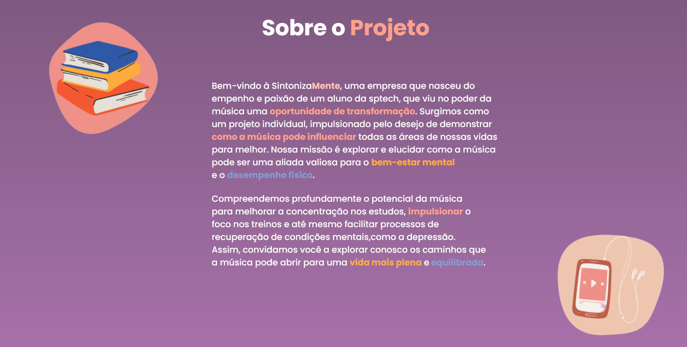
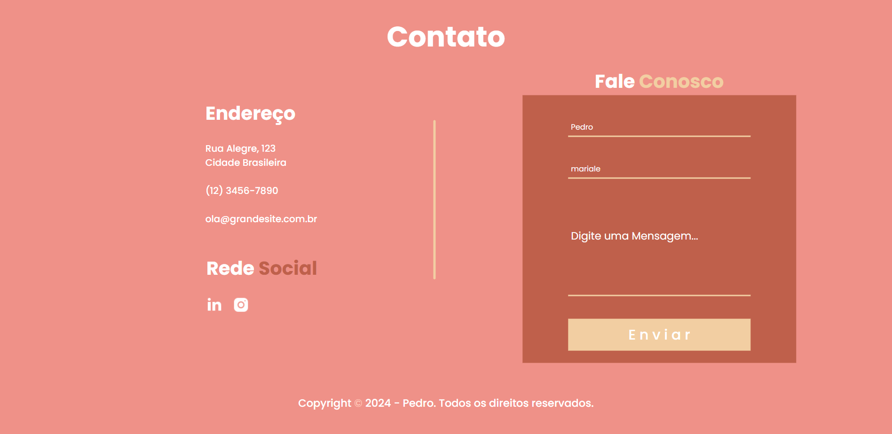

SintotizaMente - 🎻

 SintonizaMente tem como objetivo mostrar como a música pode ser uma poderosa aliada no seu desempenho diário. Através de pesquisas e estudos, demonstramos os diversos benefícios que a música pode proporcionar em diferentes aspectos da vida. Oferecemos um quiz interativo que ajuda você a descobrir estilos musicais que mais podem beneficiar seu cotidiano. A partir das suas respostas, oferecemos recomendações personalizadas de playlists e músicas específicas para cada necessidade

Site Institucional - 💻

Bem-vindo ao SintonizaMente, seu portal para explorar como a música pode transformar seu dia a dia. Nosso site institucional apresenta nosso projeto, que visa mostrar os benefícios da música no desempenho e bem-estar diário.

   Tecnologias - ⚙ 

<svg xmlns="http://www.w3.org/2000/svg" viewBox="0 0 128 128"><path fill="#1572B6" d="M19.67 26l8.069 90.493 36.206 10.05 36.307-10.063L108.33 26H19.67zm69.21 50.488L86.53 98.38l.009 1.875L64 106.55v.001l-.018.015-22.719-6.225L39.726 83h11.141l.79 8.766 12.347 3.295-.004.015v-.032l12.394-3.495L77.702 77H51.795l-.222-2.355-.506-5.647L50.802 66h27.886l1.014-11H37.229l-.223-2.589-.506-6.03L36.235 43h55.597l-.267 3.334-2.685 30.154M89 14.374L81.851 6H89V1H73v4.363L81.39 13H73v5h16zm-19 0L63.193 6H70V1H55v4.363L62.733 13H55v5h15zM52 13h-8V6h8V1H38v17h14z"/></svg>

<svg xmlns="http://www.w3.org/2000/svg" viewBox="0 0 128 128"><path fill="#E44D26" d="M19.569 27l8.087 89.919 36.289 9.682 36.39-9.499L108.431 27H19.569zM91.61 47.471l-.507 5.834L90.88 56H48.311l1.017 12h40.54l-.271 2.231-2.615 28.909-.192 1.69L64 106.964v-.005l-.027.012-22.777-5.916L39.65 84h11.168l.791 8.46 12.385 3.139.006-.234v.012l12.412-2.649L77.708 79H39.153l-2.734-30.836L36.152 45h55.724l-.266 2.471zM27.956 1.627h5.622v5.556h5.144V1.627h5.623v16.822h-5.623v-5.633h-5.143v5.633h-5.623V1.627zm23.782 5.579h-4.95V1.627h15.525v5.579h-4.952v11.243h-5.623V7.206zm13.039-5.579h5.862l3.607 5.911 3.603-5.911h5.865v16.822h-5.601v-8.338l-3.867 5.981h-.098l-3.87-5.981v8.338h-5.502V1.627zm21.736 0h5.624v11.262h7.907v5.561H86.513V1.627z"/></svg>

<svg xmlns="http://www.w3.org/2000/svg" viewBox="0 0 128 128"><path fill="#00618A" d="M0 91.313h4.242V74.566l6.566 14.598c.773 1.77 1.832 2.391 3.914 2.391s3.098-.621 3.871-2.391l6.566-14.598v16.746h4.242V74.594c0-1.633-.652-2.422-2-2.828-3.223-1.004-5.383-.137-6.363 2.039l-6.441 14.41-6.238-14.41c-.937-2.176-3.14-3.043-6.359-2.039-1.348.406-2 1.195-2 2.828zM32.93 77.68h4.238v9.227c-.039.5.16 1.676 2.484 1.715h9.223V77.633h4.25c.02 0-.008 14.984-.008 15.047.023 3.695-4.582 4.496-6.707 4.559H33.02v-2.852l13.414-.004c2.73-.285 2.406-1.645 2.406-2.098v-1.113h-9.012c-4.195-.039-6.863-1.871-6.898-3.977-.004-.191.09-9.422 0-9.516zm23.461 13.633h12.195c1.426 0 2.813-.301 3.914-.816 1.836-.84 2.73-1.984 2.73-3.48v-3.098c0-1.223-1.016-2.367-3.016-3.125-1.059-.41-2.367-.625-3.629-.625h-5.141c-1.711 0-2.527-.516-2.73-1.656-.039-.137-.039-.246-.039-.383V76.2c0-.109 0-.219.039-.355.203-.867.652-1.113 2.16-1.25l.41-.027h12.109v-2.824H63.488c-1.711 0-2.609.109-3.426.352-2.527.789-3.629 2.039-3.629 4.215v2.473c0 1.902 2.16 3.535 5.789 3.914.41.027.816.055 1.223.055h4.406c.164 0 .324 0 .449.027 1.344.109 1.914.355 2.324.844.211.195.332.473.324.758v2.477c0 .297-.203.68-.609 1.004-.367.328-.98.543-1.793.598l-.449.027H56.391zm45.297-4.922c0 2.91 2.164 4.539 6.523 4.867.41.027.816.055 1.227.055h11.051v-2.828h-11.133c-2.488 0-3.426-.625-3.426-2.121V71.738h-4.238V86.39zm-23.75.148V76.457c0-2.559 1.801-4.113 5.355-4.602a7.976 7.976 0 0 1 1.145-.082h8.047c.41 0 .777.027 1.188.082 3.555.488 5.352 2.043 5.352 4.602v10.082c0 2.078-.762 3.188-2.523 3.914l4.18 3.77h-4.926l-3.379-3.051-3.402.215H84.44a9.23 9.23 0 0 1-2.492-.352c-2.699-.734-4.008-2.152-4.008-4.496zm4.578-.246c0 .137.043.273.082.438.246 1.172 1.352 1.824 3.023 1.824h3.852l-3.539-3.195h4.926l3.086 2.789c.57-.305.945-.766 1.074-1.363.043-.137.043-.273.043-.41v-9.668c0-.109 0-.246-.043-.383-.246-1.09-1.348-1.715-2.98-1.715h-6.418c-1.879 0-3.105.816-3.105 2.098zm41.703-19.246c-2.605-.07-4.598.172-6.301.891-.484.203-1.258.207-1.336.813.266.281.309.699.52 1.039.406.66 1.094 1.539 1.707 2 .664.508 1.355 1.047 2.074 1.484 1.273.777 2.699 1.223 3.93 2 .723.461 1.441 1.039 2.148 1.559.348.254.582.656 1.039.816v-.074c-.238-.305-.301-.723-.52-1.039l-.965-.965c-.941-1.25-2.137-2.348-3.41-3.262-1.016-.727-3.281-1.711-3.707-2.891l-.074-.074c.719-.078 1.563-.34 2.223-.516 1.117-.301 2.113-.223 3.262-.52l1.559-.449v-.293c-.582-.598-.996-1.387-1.633-1.93-1.656-1.41-3.469-2.824-5.336-4.004-1.035-.652-2.312-1.074-3.41-1.629-.367-.187-1.016-.281-1.262-.594-.574-.734-.887-1.664-1.332-2.52a96.534 96.534 0 0 1-2.668-5.633c-.562-1.285-.93-2.555-1.633-3.707-3.363-5.535-6.988-8.875-12.602-12.156-1.191-.699-2.633-.973-4.148-1.332l-2.449-.148c-.496-.211-1.012-.82-1.48-1.113-1.859-1.176-6.629-3.73-8.008-.371-.867 2.121 1.301 4.191 2.078 5.266.543.754 1.242 1.598 1.629 2.445.258.555.301 1.113.52 1.703.539 1.453 1.008 3.031 1.707 4.375.352.68.738 1.395 1.184 2 .273.371.742.539.816 1.113-.457.641-.484 1.633-.742 2.445-1.16 3.652-.723 8.191.965 10.898.516.828 1.734 2.609 3.41 1.926 1.465-.598 1.137-2.445 1.555-4.078.098-.367.039-.641.223-.887v.074l1.336 2.668c.988 1.59 2.738 3.25 4.223 4.371.773.582 1.379 1.59 2.375 1.93V68.6h-.074c-.195-.297-.496-.422-.742-.664-.582-.57-1.227-1.277-1.703-1.93-1.352-1.832-2.547-3.84-3.633-5.93-.52-.996-.973-2.098-1.41-3.113-.168-.391-.164-.984-.516-1.184-.48.742-1.187 1.344-1.559 2.223-.594 1.402-.668 3.117-.891 4.891l-.148.074c-1.031-.25-1.395-1.312-1.777-2.223-.973-2.305-1.152-6.02-.297-8.672.219-.687 1.219-2.852.813-3.484-.191-.633-.828-1-1.184-1.484a11.7 11.7 0 0 1-1.187-2.074c-.793-1.801-1.164-3.816-2-5.633-.398-.871-1.074-1.75-1.629-2.523-.617-.855-1.305-1.484-1.781-2.52-.168-.367-.398-.957-.148-1.336.078-.254.195-.359.445-.441.43-.332 1.629.109 2.074.293 1.191.496 2.184.965 3.191 1.633.48.32.969.941 1.555 1.113h.668c1.043.238 2.211.07 3.188.367 1.723.523 3.27 1.34 4.668 2.227 4.273 2.695 7.766 6.535 10.156 11.117.387.738.551 1.441.891 2.223.684 1.578 1.543 3.203 2.223 4.746s1.34 3.094 2.297 4.375c.504.672 2.453 1.031 3.336 1.406.621.262 1.637.535 2.223.891 1.125.676 2.211 1.48 3.266 2.223.523.375 2.141 1.188 2.223 1.855zM91.082 38.805a5.26 5.26 0 0 0-1.332.148v.074h.074c.258.535.715.879 1.035 1.336l.742 1.555.074-.07c.461-.324.668-.844.668-1.633-.187-.195-.211-.437-.371-.668-.211-.309-.621-.48-.891-.742zm0 0"/></svg>

<svg xmlns="http://www.w3.org/2000/svg" viewBox="0 0 128 128"><path fill="#F0DB4F" d="M1.408 1.408h125.184v125.185H1.408z"/><path fill="#323330" d="M116.347 96.736c-.917-5.711-4.641-10.508-15.672-14.981-3.832-1.761-8.104-3.022-9.377-5.926-.452-1.69-.512-2.642-.226-3.665.821-3.32 4.784-4.355 7.925-3.403 2.023.678 3.938 2.237 5.093 4.724 5.402-3.498 5.391-3.475 9.163-5.879-1.381-2.141-2.118-3.129-3.022-4.045-3.249-3.629-7.676-5.498-14.756-5.355l-3.688.477c-3.534.893-6.902 2.748-8.877 5.235-5.926 6.724-4.236 18.492 2.975 23.335 7.104 5.332 17.54 6.545 18.873 11.531 1.297 6.104-4.486 8.08-10.234 7.378-4.236-.881-6.592-3.034-9.139-6.949-4.688 2.713-4.688 2.713-9.508 5.485 1.143 2.499 2.344 3.63 4.26 5.795 9.068 9.198 31.76 8.746 35.83-5.176.165-.478 1.261-3.666.38-8.581zM69.462 58.943H57.753l-.048 30.272c0 6.438.333 12.34-.714 14.149-1.713 3.558-6.152 3.117-8.175 2.427-2.059-1.012-3.106-2.451-4.319-4.485-.333-.584-.583-1.036-.667-1.071l-9.52 5.83c1.583 3.249 3.915 6.069 6.902 7.901 4.462 2.678 10.459 3.499 16.731 2.059 4.082-1.189 7.604-3.652 9.448-7.401 2.666-4.915 2.094-10.864 2.07-17.444.06-10.735.001-21.468.001-32.237z"/></svg>

